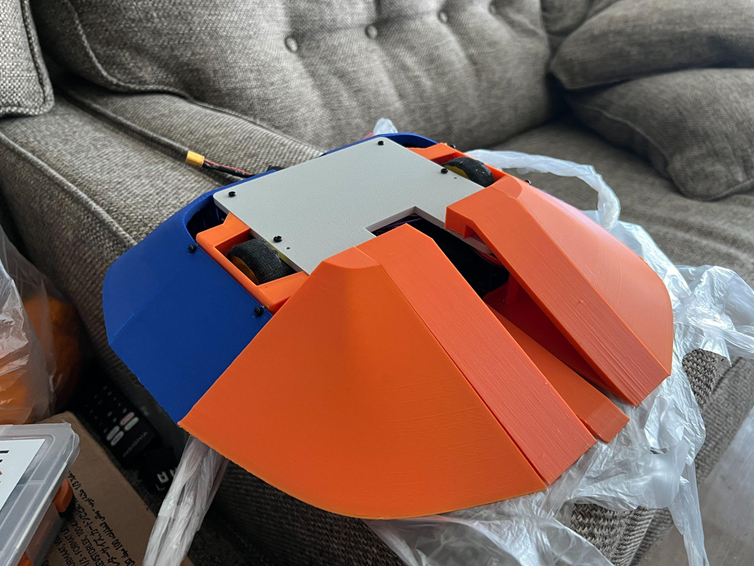
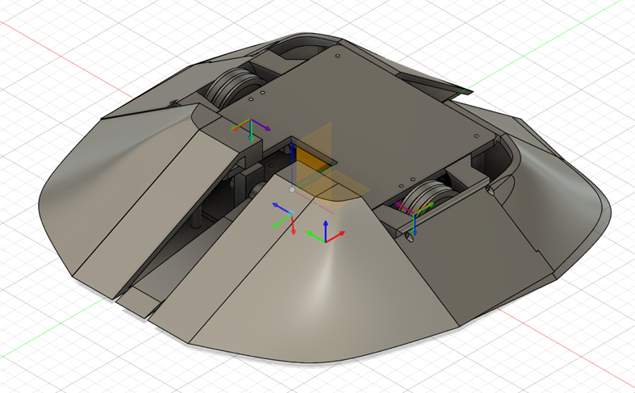
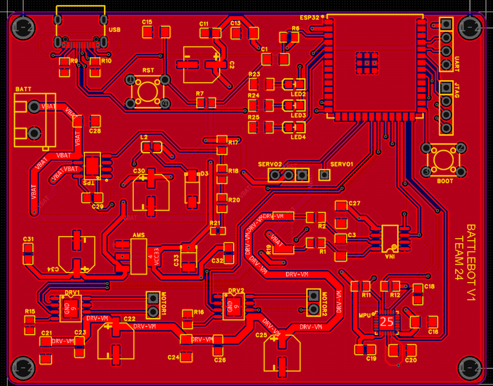

# Antweight Battlebot

A **2-lb ESP32-S3-based combat robot** integrating embedded control, custom electronics, wireless teleoperation, motor control, power management, and a custom-designed mechanical chassis.

  

  <b>Embedded Systems · Robotics · PCB Design · CAD · Hardware–Software Integration</b>

---

## Overview

This project is a two-person senior design project developed at the **University of Illinois Urbana-Champaign**.

Our goal was to design and build a compact antweight combat robot that combines reliable wireless control, robust drivetrain operation, safe power management, and a mechanically integrated chassis within a **2-lb weight constraint**.

The final system brings together:

- **ESP32-S3-based embedded control**
- Wi-Fi teleoperation
- Brushed DC motor control
- Custom PCB and power-distribution circuitry
- Battery and current monitoring
- Manual and communication-loss safety behavior
- Custom CAD-designed chassis and armor
- 3D-printed mechanical components
- Full electrical, firmware, and mechanical integration

---

## System Design

The robot was developed as several interacting subsystems:

| Subsystem | Function |
| --- | --- |
| **Control & Communication** | ESP32-S3-based wireless command processing and system control |
| **Power** | 3S LiPo power distribution, regulation, monitoring, and shutdown |
| **Drivetrain** | Brushed DC motors and motor-driver control |
| **Front Mechanism** | Front wedge / lifting mechanism for combat interaction |
| **Mechanical Platform** | Chassis, armor, mounting, packaging, and drivetrain integration |

A major engineering challenge was fitting the battery, control electronics, motors, wiring, and mechanical structure into a compact chassis while maintaining accessibility, wheel clearance, structural rigidity, and a low center of mass.

---

## Mechanical Design

The chassis was iteratively designed in CAD around the physical dimensions of the drivetrain, battery, PCB, wiring, wheels, and front mechanism.

Key design considerations included:

- Compact component packaging
- Motor and wheel clearance
- PCB and battery mounting
- Connector and wiring accessibility
- Low battery placement for improved stability
- Chassis stiffness and protection
- Assembly and maintenance access
- 3D-printability and support requirements

  

The mechanical design went through repeated CAD, slicing, printing, and physical fit-check iterations before final integration.

---

## Electronics

The robot uses a custom PCB to integrate the main embedded-control and electrical interfaces.

The board supports the ESP32-S3 control system alongside motor-control interfaces, power regulation, sensing, and other supporting circuitry.

  

Electrical integration required careful consideration of:

- Battery and power-distribution routing
- Logic-power stability
- Motor-driver connections
- Connector accessibility
- PCB placement within the chassis
- Motor-current monitoring
- Safe system shutdown

---

## Embedded Control & Safety

The ESP32-S3 serves as the central controller for the robot.

The embedded system is responsible for:

- Receiving wireless commands
- Translating operator input into motor commands
- Managing drivetrain behavior
- Monitoring system state
- Handling manual shutdown
- Detecting communication loss
- Moving the system into a safe state when control is lost

Safe shutdown behavior was treated as a core system requirement rather than an optional feature.

---

## My Contributions

My primary responsibility was the **mechanical design and physical system integration**, while also contributing to system-level design, documentation, verification planning, and final integration.

### Mechanical CAD & Packaging

- Developed the initial chassis layout and internal component arrangement.
- Designed packaging for the battery, PCB, motors, wheels, wiring, and front mechanism.
- Refined motor mounting regions and wheel clearances to prevent mechanical interference.
- Positioned the battery low and near the center of the chassis to improve stability.
- Designed around connector access, assembly order, and maintenance requirements.
- Iterated the chassis geometry as component dimensions and integration constraints became clearer.

### Component Selection & Integration Planning

- Researched drivetrain, battery, and mechanical components.
- Checked compatibility between motor shafts, wheels, battery connectors, and planned mechanical interfaces.
- Updated the CAD model based on actual component dimensions.
- Coordinated PCB placement and internal wiring paths with the electrical design.

### Prototyping & Manufacturing

- Prepared mechanical models for 3D printing.
- Reviewed print orientation, support placement, and slicing configuration.
- Test-fitted the motors, wheels, battery, and PCB in printed chassis components.
- Identified and corrected clearance and assembly issues discovered during physical integration.

### Electrical & System Integration

- Assisted with PCB assembly and inspection.
- Verified that the assembled PCB fit within the reserved chassis volume.
- Helped evaluate battery, motor-driver, and control-board wire routing.
- Supported final mechanical/electrical integration and system verification.

### System Design & Documentation

- Contributed to the project proposal and system-level requirements.
- Participated in subsystem decomposition and architecture discussions.
- Helped define measurable verification requirements for control, drivetrain, power, and safety behavior.
- Contributed to the design document, verification planning, final integration, and presentation preparation.

---

## Engineering Process

The project followed an iterative hardware-development workflow:

**Requirements → Architecture → CAD → Component Selection → PCB / Mechanical Development → Prototyping → Integration → Verification**

Rather than treating the mechanical, electrical, and software components independently, the system was repeatedly revised as cross-domain constraints became apparent.

Examples included:

- Updating CAD after receiving real component dimensions
- Adjusting chassis geometry for connector and wire clearance
- Revising component placement to simplify assembly
- Test-fitting electronics before final mechanical integration
- Coordinating power, control, and mechanical requirements during final system integration

---

## Verification

The completed system was evaluated through subsystem and integration testing focused on:

- Wireless-control responsiveness
- Communication-loss shutdown
- Drivetrain operation
- Power-system stability
- Mechanical fit and wheel clearance
- PCB and wiring integration
- Full-system operation

Testing and design changes were performed iteratively as the electrical and mechanical subsystems were brought together.

---

## Project Gallery

### CAD Design

  

### Custom PCB

  

### Final Integration

  

---

## Technologies

**Embedded**

`ESP32-S3` · `C/C++` · `Wi-Fi` · `Motor Control`

**Hardware**

`PCB Design` · `Power Electronics` · `Current Sensing` · `3S LiPo`

**Mechanical**

`Fusion 360` · `CAD` · `3D Printing` · `Mechanical Integration`

**Engineering**

`Hardware–Software Co-Design` · `System Integration` · `Verification` · `Robotics`

---

## Team

**Yuxuan (Neal) Guo**  
Mechanical design, system packaging, prototyping, integration, and system-level engineering

**Junyan Bai**  
Team member and co-designer

This project was developed collaboratively as a two-person senior design project.

---

## Course

**ECE 445 — Senior Design**  
University of Illinois Urbana-Champaign  
Spring 2026

---

## Documentation

This repository is a curated engineering showcase of the completed project.

The original course repository contains the semester-long lab notebooks and development history. Additional design documentation, firmware, verification results, and selected engineering artifacts may be added here as the project repository is further organized.
